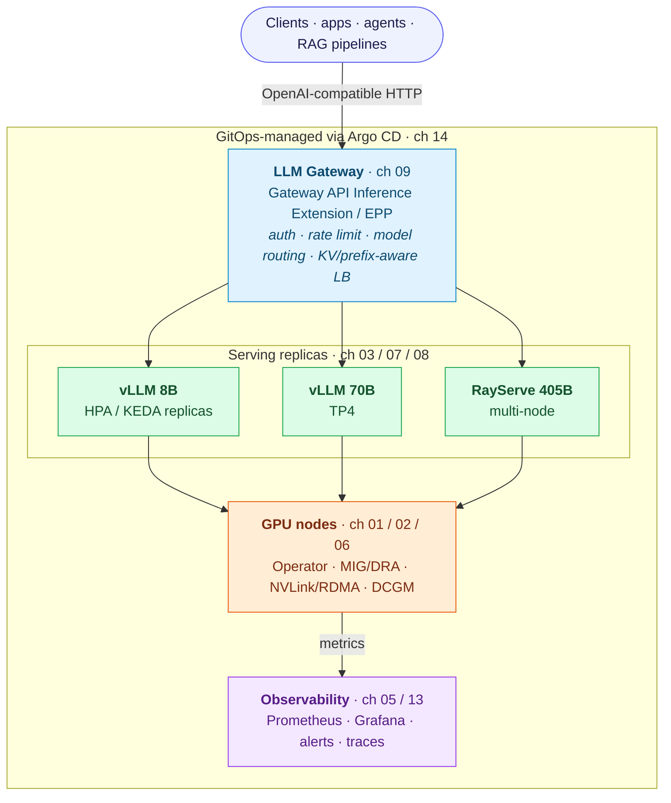

<h1 align="center">vLLM on Kubernetes</h1>

<p align="center">
  <b>Production LLM serving on Kubernetes - the decisions that actually matter.</b><br>
  A deep, current (2026) walkthrough series: from GPU plumbing to a full GitOps reference architecture.
</p>

<p align="center">
  <a href="https://github.com/a-oukacha/vllm-on-kubernetes/actions/workflows/ci.yml"></a>
  <a href="CONTRIBUTING.md"></a>
  <a href="LICENSE"></a>
</p>

---

## Motivation

**Learn how to serve large language models in production.**

There is a lot written about getting `vllm serve` running on a laptop, and almost nothing about
what happens after. This series is the part after: GPU sharing, KV cache, multi-node sharding,
gateway routing, autoscaling, rollout safety, cost, and multi-tenancy. The choices that decide
whether your LLM endpoint survives a real SLO.

**Get the production decisions, not a hello-world.**

I wrote this to pin down the things I kept having to re-derive on real clusters: which engine flag
actually moves latency, when a model stops being a Deployment and becomes a scheduling problem, how
to roll out a new model without surprising your users, and where the money goes. Every chapter is
opinionated about what to pick and honest about where it breaks.

It assumes you already know Kubernetes. This is the production layer that sits on top.

## Have a look

The whole platform on one page - each box maps to a chapter:



If you read nothing else, take this: **a model that fits one GPU is a Deployment problem; a model
that needs many GPUs is a scheduling and networking problem.** Chapters 06-08 are where that line
gets crossed.

## Where to start

You don't have to read every chapter to get value. Pick the entry point that matches you:

- **New to GPUs on Kubernetes?** Start at the top - [chapter 01](kube-vllm/01-gpu-k8s-fundamentals.md). The plumbing matters more than it looks.
- **Already serving a single GPU and hitting limits?** Jump to [chapter 06](kube-vllm/06-distributed-inference.md) for distributed inference.
- **Just want the reference architecture?** Go straight to [chapter 14](kube-vllm/14-reference-architecture-gitops.md) and work backwards.
- **Chasing a GPU bill?** [Chapter 10](kube-vllm/10-autoscaling-capacity-cost.md) is about capacity and cost.

Otherwise, read it in order. The chapters build on each other.

## The series

**Part A - Foundations (single node)**

| # | Chapter | What it covers |
|---|---------|----------------|
| 01 | [GPU + Kubernetes fundamentals](kube-vllm/01-gpu-k8s-fundamentals.md) | device plugin, CDI, MIG/MPS/time-slicing/DRA, taints, topology |
| 02 | [GPU Operator](kube-vllm/02-gpu-operator.md) | ClusterPolicy, DCGM, GFD/NFD, driver strategy |
| 03 | [Deploying vLLM](kube-vllm/03-vllm-deployment.md) | `vllm serve`, the V1 engine, modern flags, probes, sizing |
| 04 | [Storage & models](kube-vllm/04-storage-and-models.md) | PVC strategies, fast model loading, OCI modelcars |
| 05 | [Operations & monitoring](kube-vllm/05-operations-monitoring.md) | vLLM V1 metrics, DCGM, Prometheus/Grafana, KEDA basics |

**Part B - Distributed & production**

| # | Chapter | What it covers |
|---|---------|----------------|
| 06 | [Distributed inference](kube-vllm/06-distributed-inference.md) | tensor/pipeline parallelism, when to go multi-GPU |
| 07 | [RayService production serving](kube-vllm/07-rayservice-production-serving.md) | KubeRay RayService + Ray Serve LLM, GCS fault tolerance, upgrades |
| 08 | [LeaderWorkerSet multi-node](kube-vllm/08-leaderworkerset-multinode.md) | native multi-node sharding, gang scheduling |
| 09 | [LLM gateway & routing](kube-vllm/09-llm-gateway-routing.md) | Gateway API Inference Extension, KV/prefix-aware routing, P/D |
| 10 | [Autoscaling, capacity & cost](kube-vllm/10-autoscaling-capacity-cost.md) | scale-to-zero, capacity math, spot, the cost levers |
| 11 | [Reliability & rollouts](kube-vllm/11-reliability-rollouts.md) | PDBs, GPU failure, multi-AZ, canary/blue-green model rollouts |
| 12 | [Security & multi-tenancy](kube-vllm/12-security-multitenancy.md) | NetworkPolicy, authn/z, mTLS, isolation, weight supply chain |
| 13 | [Benchmarking & observability](kube-vllm/13-benchmarking-observability.md) | load testing, SLOs, golden signals, tracing |
| 14 | [Reference architecture & GitOps](kube-vllm/14-reference-architecture-gitops.md) | the full blueprint, Helm + Argo CD, environment promotion |

There's also a [version matrix](kube-vllm/README.md#version-matrix-what-current-means-here) that
pins what "current" means for every component referenced here.

## How each chapter is written

Every chapter carries three tiers of field notes, so you can read for your own role and skim the
rest:

| Tier | Written for | Focus |
|------|-------------|-------|
| **Senior Dev tip** | Application / model engineers | engine flags, model behavior, request shaping, KV cache |
| **Senior DevOps tip** | Platform / SRE | scheduling, rollout, failure modes, observability, cost |
| **Architect tip** | Staff / principal | trade-offs, topology, capacity, org boundaries, build-vs-buy |

A note on scope: this is a written series, not a runnable lab kit. The YAML in each chapter is
illustrative and production-shaped - read it, adapt it, don't apply it blind. You bring your own GPU
cluster. Where a choice is cloud- or hardware-specific, the trade-off is called out rather than
hidden behind one vendor.

## Read it as a site

```bash
git clone https://github.com/a-oukacha/vllm-on-kubernetes.git
cd vllm-on-kubernetes
make serve        # docsify on localhost:3009
```

Or just open the Markdown files in [`kube-vllm/`](kube-vllm/) - they read fine on their own.

## Contributing

Corrections, sharper trade-offs, and war stories are all welcome - vLLM moves fast and some of this
will drift. Found something out of date or plain wrong? Open an issue or a PR. See
[CONTRIBUTING.md](CONTRIBUTING.md) for the (short) ground rules.

A few things on the roadmap:

- [ ] Refresh flags and V1-engine notes as new vLLM releases land.
- [ ] A worked failure-injection example for the RayService and LeaderWorkerSet chapters.
- [ ] A short "minimum viable single-GPU" appendix for people without a multi-node cluster.

## License

MIT - see [LICENSE](LICENSE). Use it, fork it, teach from it.
